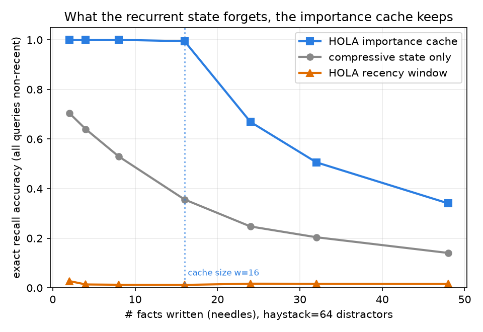
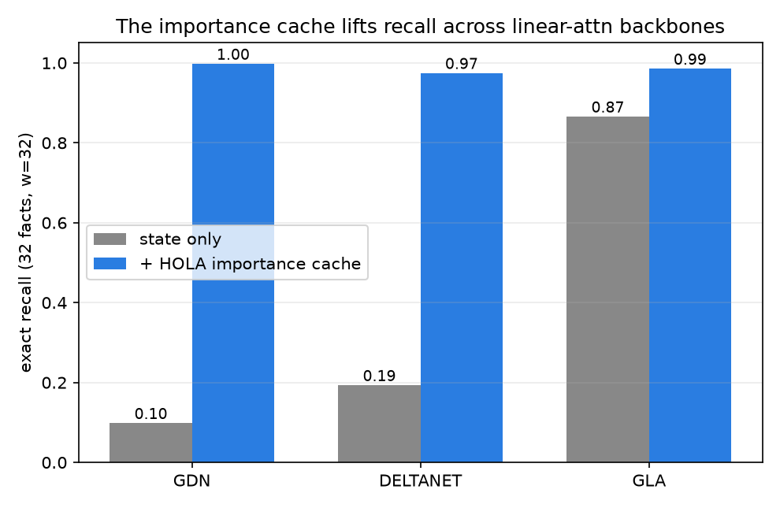

# HOLA — a Hippocampus for Linear Attention (minimal reproduction)

A small, dependency-light, **CPU/Mac-friendly** reproduction of the mechanism in
**"A Hippocampus for Linear Attention: An Exact Memory for What the Recurrent
State Forgets"** (Wanyun Cui, [arXiv:2607.02303](https://arxiv.org/abs/2607.02303)).

The paper augments a linear-attention model (Gated DeltaNet) with a **bounded,
exact key-value cache** — a "hippocampus" beside the compressive recurrent state.
Two ideas do the work, and both are tiny bolt-on modules:

1. **Importance-based memory.** Keep the top-`w` tokens by *surprise*
   `βₜ·‖eₜ‖` — the delta-rule write magnitude, i.e. how much each token *changed*
   the state — instead of the most *recent* tokens. `eₜ = vₜ − αₜ·kₜᵀS₍ₜ₋₁₎` is the
   prediction residual: what the compressed state could **not** predict.
2. **Decoupled RMSNorm-γ read.** Normalise query/key on the cache read so logits
   scale like `√d·cos` → **near-argmax** (exact) retrieval, while the state-update
   path keeps unit-L2 vectors. The sharpening is decoupled from the recurrence.

The official paper has no released code; this repo reimplements the mechanism in
**pure PyTorch** (no Triton/CUDA kernels) and studies it at a scale that runs for
**$0 on a laptop**, on the synthetic **MQAR** (multi-query associative recall) task
where exact recall is exactly what's being measured.

## What's in here (three builds)

| Build | Question | Entry point |
|-------|----------|-------------|
| **1. Repro** | Does importance-memory beat a recency window as memory load grows? | `experiments/exp1_importance_vs_recency.py` |
| **2. Forget-probe** | Does `β·‖e‖` really mark what the state forgets — and does the importance cache cover those failures better than recency? (paper only *asserts* this) | `hola/hola/probe.py` |
| **3. Any-backbone** | Does the cache generalise past Gated DeltaNet to DeltaNet / GLA? (paper tests GDN only) | `experiments/exp3_anybackbone.py` |

## Install & run

```bash
pip install -r requirements.txt          # torch, numpy, matplotlib

# offline unit checks (seconds, no training) — verifies the core mechanism
python hola/tests/test_core.py

# 1) money plot: recall vs memory load, GDN vs HOLA(importance) vs HOLA(recency)
python hola/experiments/exp1_importance_vs_recency.py --steps 1500 --npairs 8 24 48

# 2) does it generalise across backbones? (mechanistic, seconds)
python hola/experiments/exp3_anybackbone.py

# 3) forget-probe on a trained GDN: surprise -> forgetting, and failure coverage
python hola/hola/probe.py --steps 1800
```

Results (JSON + PNG) are written to `results/`.

## Design notes / faithful-in-spirit

Because there's no reference implementation, the modules follow the paper's
*equations and intent*, not its exact kernels:

- **Backbone** (`hola/backbones.py`): a plain recurrent Gated DeltaNet
  `S_t = α_t S_{t-1} + β_t k_t ⊗ e_t`, plus DeltaNet (`α=1`) and GLA (additive) for
  the generalisation study. Each exposes the per-token surprise score.
- **Cache** (`hola/cache.py`): per-chunk read set = `{top-w by surprise} ∪ {current
  chunk, causal} ∪ {learnable null sink}`, mirroring the paper's `w + C + 1`.
- **Two lessons this reproduction makes explicit** (things the paper takes for
  granted at scale but that *dominate* at small scale):
  - the recurrent state needs its **decay initialised ≈ 1** or `α^t` erases memory;
  - linear-attn needs a **short causal conv** to bind key→value across positions,
    or it cannot solve MQAR at all (the Based/Zoology result).

## Results

### Money plot — the mechanism (`experiments/exp2_mechanistic_recall.py`, no training, seconds)

Write `N` random facts into a delta-rule state, bury them under a 64-token haystack of
low-surprise distractors, then query **every** fact (all non-recent). Exact recall on
the *same* tokens, three readouts, `w=16`, state dim `d=32`, 200 trials:

| # facts | compressive state | **HOLA importance** | HOLA recency |
|--------:|:-----------------:|:-------------------:|:------------:|
|   8     | 0.530             | **1.000**           | 0.013        |
|  16     | 0.356             | **0.994**           | 0.012        |
|  24     | 0.247             | **0.669**           | 0.017        |
|  32     | 0.204             | **0.506**           | 0.016        |
|  48     | 0.141             | **0.341**           | 0.016        |



- **Importance cache = perfect recall until facts exceed its capacity `w`**, then it
  falls off as `~w/N` — the exact signature of a bounded exact memory.
- **The compressive state degrades smoothly with load** (interference) — "what the
  recurrent state forgets."
- **The recency window ≈ 0** the whole way: every fact is early, so a sliding window
  holds only haystack. This is the ablation the paper argues against, made stark.

### Offline mechanism proof (`tests/test_core.py`, 20 checks)

Verified without any training: importance retrieval recovers an early surprising value
a recency window evicts; RMSNorm-γ gives near-argmax (not soft-average) reads; the null
sink drains the cache when nothing matches; gradients flow end-to-end.

### Generalisation — does the cache work past GDN? (`experiments/exp3_anybackbone.py`)

Same benchmark, three backbones driving the state. The importance cache lifts recall
to ~0.98 for **all** of them (32 facts, `w=32`), so the mechanism is not specific to
the delta rule:

| backbone | state only | + importance cache |
|----------|:----------:|:------------------:|
| GDN (gated delta) | 0.10 | **1.00** |
| DeltaNet (delta)  | 0.19 | **0.97** |
| GLA (additive)    | 0.87 | **0.99** |



(GLA's additive state already recalls well here, so it has less headroom — but still
benefits; the delta-rule states, which interfere more in this setup, benefit most.)

### Forget-probe on a *trained* GDN (`hola/hola/probe.py`) — an honest mixed result

Training a plain GDN on hard MQAR and probing what it forgets gives a nuance worth
reporting: **`AUC(surprise → forgotten) ≈ 0.48`** — the write-time surprise does *not*
predict *which* fact is dropped, because in MQAR every fact is equally surprising.
The importance cache still covers more of the state's failures than a recency window
(**23% vs 6%** here), but the win comes from keeping *signal over noise* and *early
over late*, not from ranking facts by surprise. (At this tiny scale the trained GDN
only reaches ~10–20% recall on the hardest settings; the mechanism is shown much more
cleanly by the training-free `exp2`/`exp3` above — see `docs/NEXT.md`.)

## Status

- ✅ Core mechanism verified offline (`test_core.py`, 20 checks).
- ✅ Mechanistic money plot (`exp2`) — importance ≫ state ≫ recency.
- ✅ Generalises across backbones (`exp3`).
- 🔬 Trained forget-probe — honest mixed result above; trained MQAR grokking is
  unreliable at this scale (`exp1`, a real reproduction lesson — see `docs/NEXT.md`).

Not affiliated with the authors. Reproduction for study.
